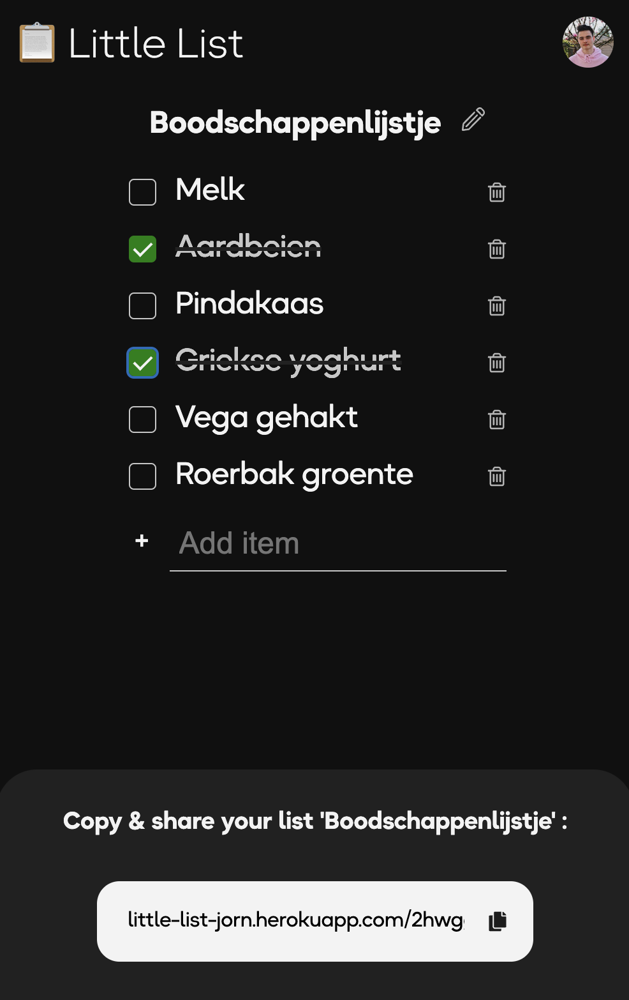

# Little List

## Inhoudsopgave
  - [Live demo](#live-demo)
  - [Beschrijving](#Beschrijving)
  - [Installatie](#Installatie)
  - [Auteurs](#Auteurs)
  - [Bijdrage](#Bijdrage)
  - [Licentie](#Licentie)

## [Live demo](https://little-list-jorn.herokuapp.com/)

## Beschrijving
Little List is een real-time checklist applicatie. Met Little List kun je lijstjes maken die instant updaten, door de constante verbinding met de server. Super handig, als je vader al in de supermarkt staat en je zet nog nét even de pindakaas op het lijstje. Deze verschijnt meteen bij paps op zijn mobiel. 



## Installatie
Clone deze repository naar jouw lokale folder:
```
git clone https://github.com/jornveltrop/little-list.git
```

## Functies
|                                                                   |     |
| ----------------------------------------------------------------- | --- |
| 📋  Handige checklist                                             | ✔   |
| ⏱️  Real-time functionaliteit                                     | ✔   |
| 🔒  Gekoppeld aan je google account                               | ✔   |
| 💾  Data wordt opgeslagen in de database                          | ✔   |


## Sockets
Deze app is gemaakt met sockets.
Sockets zijn een constante verbinding tussen de client en de server. 

Sockets worden bijvoorbeeld gebruikt voor chats en scoreborden. Deze functionaliteiten wil je namelijk instant (real-time) zichtbaar hebben tussen de verschillende apparaten. Zo hoeft de bezoeker niet de pagina te refreshen, voordat deze verandering ziet.

Ik heb voor deze applicatie gebruik gemaakt van de [socket.io](https://socket.io/) JS library.

## Supabase API (database)
Om de gegevens van de mensen op te slaan maak ik gebruik van [Supabase](https://supabase.com/). Supabase is een open source database en API systeem. Hierin heb ik een eigen database model opgezet. Deze database vul ik via de server met API calls. 

Dit is het data model wat gebruikt wordt in de database voor Little List:
<a href="docs/data-modellen.png">
	
</a>

## Data flow diagram
Om inzicht te krijgen in welke events en data er wordt verstuurd tussen de verschillende componenten is hier een visueel overzicht van de data flow:
<a href="docs/data-flow_diagram.png">
	
</a>

## To-do
Check voor de to-do's de [GitHub repository issue's pagina](https://github.com/jornveltrop/little-list/issues):

<a href="https://github.com/jornveltrop/little-list/issues">
	
</a>

## Bronnen
Voor Little List heb ik een aantal bronnen gebruikt om deze app tot stand te laten komen:

- [socket.io](https://socket.io/get-started/chat)
- [Google Authentication](https://www.youtube.com/watch?v=Q0a0594tOrc)
- [Rooms Socket.io 1](https://stackoverflow.com/questions/71037062/create-a-sharable-url-for-a-room-nodejs-socketio)
- [Rooms Socket.io 2](https://gist.github.com/crtr0/2896891)

## Auteurs
De maker van deze app is [Jorn Veltrop](https://github.com/jornveltrop).

## Bijdrage
Als je wilt bijdragen aan deze app kun je dat doen door middel van het aanmaken van een [issue](https://github.com/jornveltrop/little-list/issues).

## Licentie
Dit project valt onder de MIT [license](https://github.com/jornveltrop/little-list/blob/main/LICENSE).
